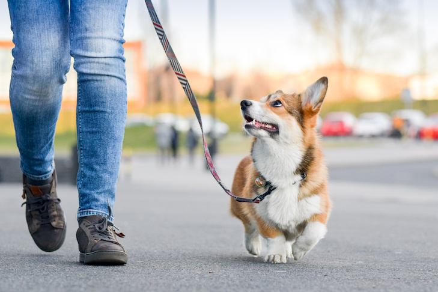

Written by: Lara Miyakawa Ho, Brooke Clifton, and Harrison Gray

## Overview
Many UH Mānoa students and faculty love animals but cannot own pets due to housing restrictions or demanding schedules. At the same time, pet owners in the campus area often need trustworthy individuals to help with walking, sitting, or short-term care. Currently, pet owners rely on informal arrangements or external apps that do not verify users, leading to safety concerns and unreliable service.

PawPal UHM is designed to connect local pet owners with verified UH students and faculty who want to offer pet care or walking services for free. The app creates a trustworthy, campus-centered network that benefits both groups while ensuring safety and animal well-being. By using UH verification, structured booking, and post-session reports, PawPal builds a culture of responsible care and genuine connection.

## Approach
To join PawPal Hawaii, users create an account and select their role as “Pet Owner,” “Walker/Sitter,” or both. Owners can create detailed profiles for their pets, including breed, size, temperament, health conditions, and walking preferences. Walkers and sitters create their own profiles listing availability, experience, comfort level with various species, and hourly or volunteer rates.

The “special sauce” of PawPal Hawaii lies in its personalized match feed, which prioritizes walkers and owners based on proximity, experience, and compatibility with the pet’s needs. For instance, if an owner’s dog is shy around other animals, the algorithm tries to find walkers who have indicated experience with anxious or reactive pets.

All first meetings are required to occur in public, daylight locations such as the Campus Center lawn or Mānoa Stream path. Once a booking is confirmed, the owner and walker can communicate through in-app messaging, share notes, and complete a short “care checklist” to ensure both parties understand expectations. After each session, the walker submits a brief care report, and the owner provides feedback and a rating.

An administrative team oversees reports, handles disputes, and ensures compliance with animal safety standards. This helps maintain accountability and fosters a culture of mutual trust and respect within the PawPal community.

## Mockup Page Ideas
Mockup ideas for PawPal Hawaii include:
- Landing Page explaining how PawPal works and outlining safety measures
- User Home Page tailored for Owners or Walkers
- Create/Edit Profile Page (pet profiles or service experience)
- Match Feed Page displaying top suggestions
- Booking Page with scheduling and notes section
- Session Details Page featuring care checklist and emergency contact info
- Rating and Feedback Page
- Admin Dashboard for verification and dispute management

## Use Case Ideas
A pet owner logs into PawPal, creates a profile for their dog, and requests a 30-minute evening walk near campus. The system recommends nearby walkers most compatible with their preferences. The owner selects a walker, confirms the booking, and meets in person at a safe location. After the walk, the walker logs the route and submits a care report, while the owner provides feedback and a star rating.

Similarly, a new walker joins PawPal, lists availability, and receives automatic notifications when an owner nearby needs urgent help. The walker can accept the request, complete the session, and earn points or reviews that boost their credibility.

## Beyond the Basics
Advanced features could include digital badges for specialized skills such as pet first-aid or reactive-dog handling, GPS-tracked walks, smart recommendations for recurring care, and integration with local veterinary clinics for emergency resources. PawPal could also host “Campus Pet Therapy Days,” where verified walkers bring animals to campus for stress-relief sessions during finals week.

By connecting responsible pet owners and caring students through a verified, campus-focused system, PawPal Hawaii supports well-being for both people and animals while nurturing community trust and companionship at UH Mānoa.

