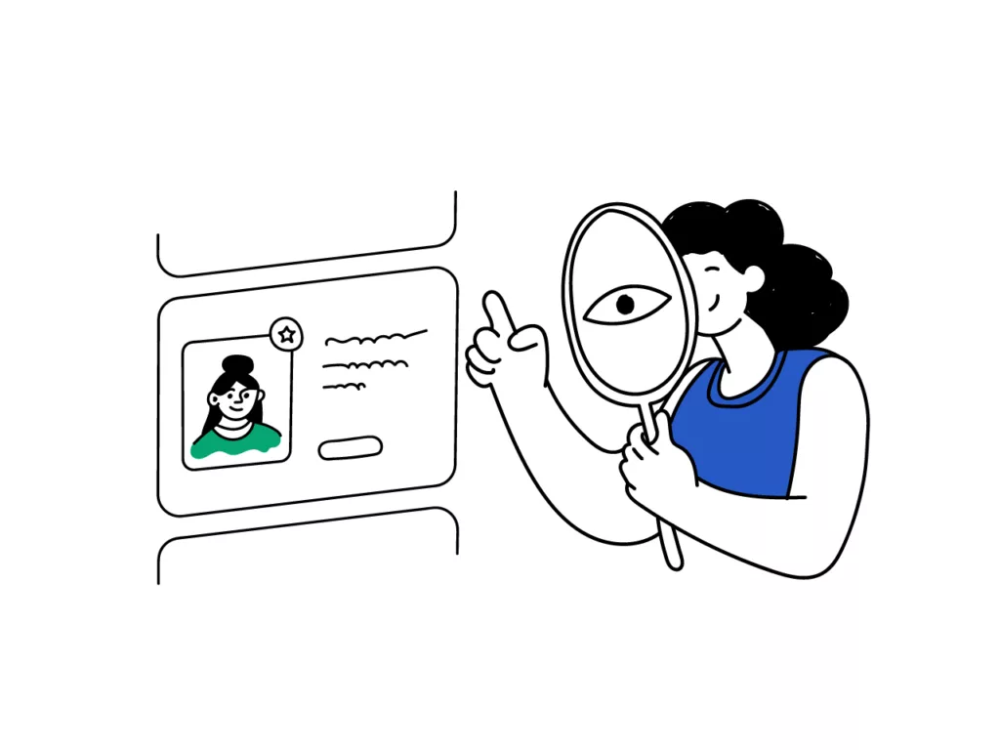

Written by: Lara Miyakawa Ho, Brooke Clifton, and Harrison Gray

## Overview
Finding a compatible roommate in Honolulu can be a frustrating experience for UH Mānoa students. Many turn to Facebook groups, Craigslist, or word of mouth, which often results in mismatched expectations, safety concerns, or scams. Students who are new to the island or moving between leases face added stress trying to secure affordable housing and trustworthy roommates.

RoomMatch UHM aims to provide a safer and more efficient way for UH Mānoa students to find housing and compatible roommates. The platform connects students based on verified UH accounts, lifestyle compatibility, and shared housing preferences. By using matching algorithms and built-in verification, RoomMatch UHM reduces uncertainty and helps students form reliable living arrangements in a safe, student-centered environment.

## Approach
To use RoomMatch UHM, a student first logs in with their UH email to verify their identity and create a personal profile. The profile captures key preferences such as budget, desired location, lease dates, daily routine, cleanliness, and noise tolerance. The student’s top five preferences are displayed up front, and other interests can be viewed by clicking into the full profile. Students can also indicate whether they are “seeking a room” or “offering a room.” The system’s “special sauce” is a compatibility algorithm that compares these preferences with those of other users and generates a compatible list. Potential roommates are then displayed in order of compatibility, making it easy for students to find the best fit quickly.

Each user has access to a dashboard displaying potential matches, direct messaging, and an option to schedule meetings in safe, public campus locations such as Hamilton Library or Campus Center. A built-in calendar feature enables users to plan meetups or manage move-in timelines. To ensure accountability, users can leave post-match feedback and rate their experience in categories such as reliability, cleanliness, and communication.

Administrators monitor the platform to ensure postings are authentic and community guidelines are upheld. Any user who suspects inappropriate behavior or fraud can report it for review. The system prioritizes both trust and transparency, making roommate matching a safer, community-supported experience for UH Mānoa students.

## Mockup Page Ideas
Some envisioned mockup pages for this project include:
- Landing Page introducing the platform and its benefits
- User Profile Page with compatibility survey and preferences weighting
- Browse Listings Page for filtering available rooms or roommate seekers
- Match Detail Page showing compatibility breakdowns
- Messaging and Scheduling Page
- Ratings and Feedback Dashboard
- Admin Dashboard for moderation and verification

## Use Case Ideas
- A new user logs in using their UH email to verify their identity.
- The user completes their profile and lifestyle survey.
- The system generates a list of potential roommates ranked by compatibility.
- The student browses available listings, messages potential matches, and schedules a meeting in a safe public space such as Hamilton Library or Campus Center.
- Administrators review and verify listings, manage user reports, and ensure compliance with community standards and platform policies.

  ## Beyond the Basics
  - After moving in together, both roommates can leave mutual feedback to promote transparency and community trust.
  - Provide a digital “roommate agreement” template outlining shared responsibilities, chores, and quiet hours.
  - Implement a “split rent” cost calculator to help roommates plan shared expenses such as utilities and parking.
  - Offer conflict mediation resources and links to student housing support services.
  - Potential formula for calculating match %:

