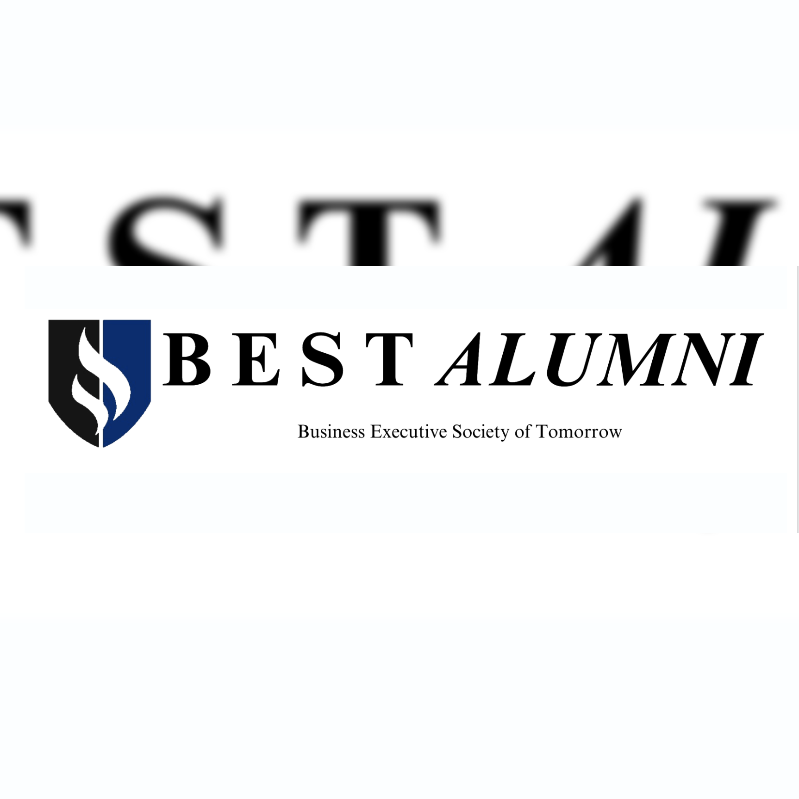

  

The Alumni Newsletter is a monthly initiative designed to keep alumni of the Business Executive Society of Tomorrow (BEST) engaged and connected to the club’s ongoing activities. Each newsletter recaps the events, accomplishments, and highlights of the club during the month while also encouraging alumni participation and support. In addition to providing updates, the goal of the newsletter is to strengthen alumni relations by creating a sense of community and value within the organization. The newsletter also promoted fundraising opportunities to help sustain and grow the club’s initiatives. By offering consistent communication, the newsletter lets alumni remain a part of the clubs' everyday life, and consequently, an integral part of BEST’s mission of professional development and leadership growth.

In my role, I was responsible for designing, writing, and distributing the newsletter each month. This included organizing content that accurately reflected the club’s events whilst structuring the newsletter in an engaging and professional way. From this experience, I had to learn how to design newsletters asthetically that aligned with our branding, while also managing and organizing a database of alumni contacts for efficient email distribution. I was required to balance both creativity and technical detail. I gained valuable skills in strategic communication, digital design, and database management. Additionally, managing the logistics of a monthly distribution schedule helped me strengthen my organizational and time management skills. 
