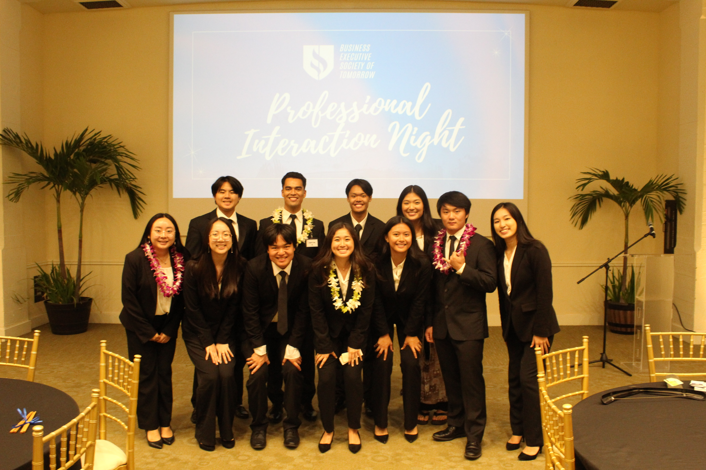

  
  
  

The Professional Interaction Night (PIN) is a semi-annual event for the Business Executive Society of Tomorrow (BEST). Unlike a traditional career fair, PIN provides a more casual, interview-style environment where professionals can get to know members on a personal level while offering mentorship, career guidance, and networking opportunities. With 88 attendees, including professionals and students, the event created a space where members can gain industry insights, strengthen professional skills, and begin building valuable long-term connections. PIN has become an integral part of the club’s mission to bridge the gap between academic learning and real-world professional development.

As the Director of Corporate Relations, I was responsible for the planning and execution of this event. My responsibilities included outreach to professionals, overseeing logistics, managing communication with participants, and making sure that the program ran smoothly on the day of the event. I also collaborated and delegated tasks with the other participants of the club's Executive Board, whose support was crucial in coordinating behind-the-scenes details that contributed to the event’s success. By leading the project, I developed stronger organizational and leadership skills, while also guarenteeing that the event upheld the high standards of BEST.

Coordinating an event of this scale taught me how to balance team relationships with logistical planning , all while maintaining clear communication across multiple participants and setting achievable goals. I also gained experience in managing a large-scale event with many moving parts. In addition, this opportunity taught me how to remain composed and navigate unexpected last-minute challenges. 
