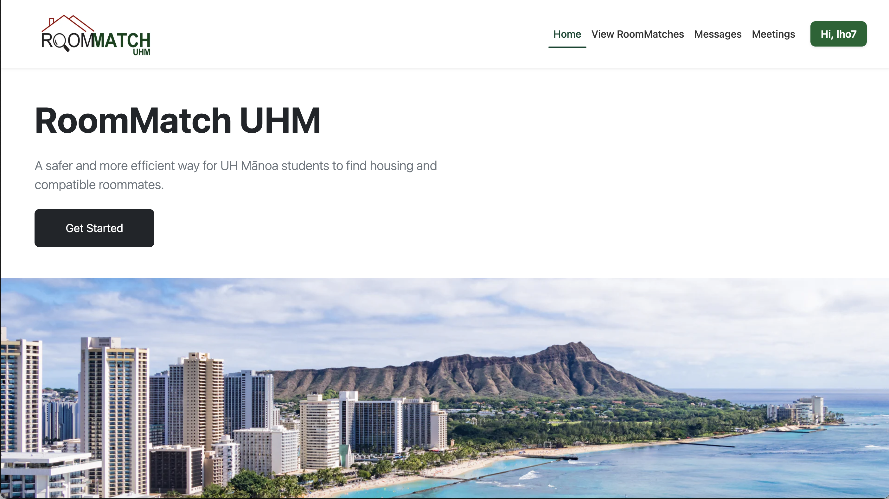

## RoomMatch UHM
RoomMatch UHM is a full-stack web application I helped design and implement as part of my ICS 314 Software Engineering final project (Fall 2025). Our team created RoomMatch UHM to address a real challenge faced by UH Mānoa students: finding compatible roommates based on lifestyle, habits, and housing preferences. The goal was to build a platform that creates safer, more comfortable living environments by matching students using shared preferences and clear communication.

Throughout this project, our team applied formal software engineering practices, modern web technologies, and collaborative development methods. The experience strengthened my understanding of full-stack development and taught me how disciplined engineering processes contribute to building reliable applications.

## Project Overview
RoomMatch UHM allows students to create personalized profiles that highlight their lifestyle preferences—such as sleep schedule, cleanliness, study habits, noise tolerance, and guest policies. Once a student registers using their UH email, they can:
- Create a personal profile with lifestyle preferences (sleep schedule, cleanliness, study habits, guests, noise tolerance, etc.)
- Browse and search for potential roommates
- Match with compatible profiles based on profile responses
- Edit and manage their profile in real time
- Chat and set meetings with potential roommates
The design emphasizes clarity, safety, and ease of use. Because UH email authentication is required, the platform ensures that only current UH students can participate, which promotes a trusted environment.

## Technologies and Tools Used

RoomMatch UHM was developed using Next.js, a powerful full-stack framework that integrates client and server logic within a single codebase. Working with this system provided me with hands-on experience building modern, scalable web applications.

# Frontend

The user interface was built with React, Next.js 14, and TypeScript. We used Bootstrap 5 and React-Bootstrap to ensure a responsive and consistent UI across all devices. This experience strengthened my ability to design clean layouts, reusable components, and accessible forms.

# Backend

For backend logic, we implemented Next.js Server Actions, which allowed us to handle form submissions, database writes, and profile updates securely. Our database was built using:
- Prisma ORM for schema modeling and migrations
- PostgreSQL for persistent storage

# Authentication and Deployment

Authentication was handled through NextAuth, configured to accept only @hawaii.edu email addresses. The final application was deployed to Vercel, enabling continuous deployment with every pull request merge.

# Development Practices

This project required the consistent use of:
- GitHub issue-driven project management
- Feature branches
- Pull request reviews
- ESLint for coding standards
- Regular team meetings and sprint planning

Together, these tools taught me the importance of structure, communication, and maintainable code.

## My Contributions to the Project

My Contributions to RoomMatch UHM

Throughout the project, I contributed extensively to both the user interface and application structure. My primary responsibilities included:

# 1. Navigation Bar (Navbar)

I implemented the site-wide navigation bar, making sure it remained fully responsive, consistent, and intuitive. This included authenticated vs. unauthenticated states, collapsible menus, and clean Bootstrap styling across desktop and mobile screens.

# 2. Footer

I designed and implemented the application’s footer, providing structural continuity across pages and maintaining a professional layout consistent with the UI style guide.

# 3. Sign-In and Sign-Up Pages

I developed the authentication pages, which allowed users to register using their UH email, log in with secure form validation, and access protected routes only after authentication

# 4. Meetings Page

I built the Meetings page interface, where users can view or schedule connections with potential roommates. This section is designed to support future expansion for built-in calendars or messaging features.

# 5. Messages Page

I created the Messages page layout, which lays the foundation for direct communication between students.

# 6. Team Coordination

Beyond development tasks, I participated in weekly meetings, issue refinement, task estimation, testing, and group decision-making. Maintaining clear teamwork was essential for completing the project within the scheduled milestones.

In addition, I participated fully in GitHub project management by writing issues, estimating task difficulty, creating branches, writing pull requests, and performing code reviews. This collaborative workflow helped me better understand how modern software teams maintain structure and accountability.

## Skills and Lessons Learned

Working on RoomMatch UHM expanded my understanding of software engineering far beyond building isolated features. Throughout the project, I learned how to organize development tasks using GitHub issues, milestones, and a structured workflow that kept the team aligned. I became more comfortable writing clean, standardized TypeScript that followed ESLint rules, and I gained confidence collaborating through pull requests, code reviews, and shared responsibility for the codebase. I also learned how to debug both client-side and server-side logic, which helped me understand the full data flow of a modern web application. On the backend, I developed skills in managing Prisma schemas, running migrations, and maintaining synchronization between development and production databases. Finally, working closely on UI components deepened my ability to think about user experience, visual design, accessibility, and how users move through an application. By the end of the project, I felt much more confident in my ability to design, build, and deploy a full-stack application from start to finish.

 
Source: <a href="https://roommatch-uhm.github.io/">RoomMatchUHM/RoomMatchUHM</a>
